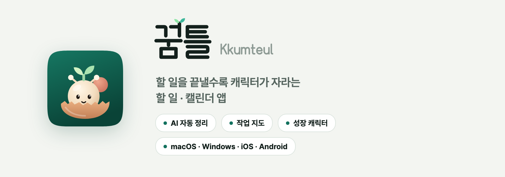
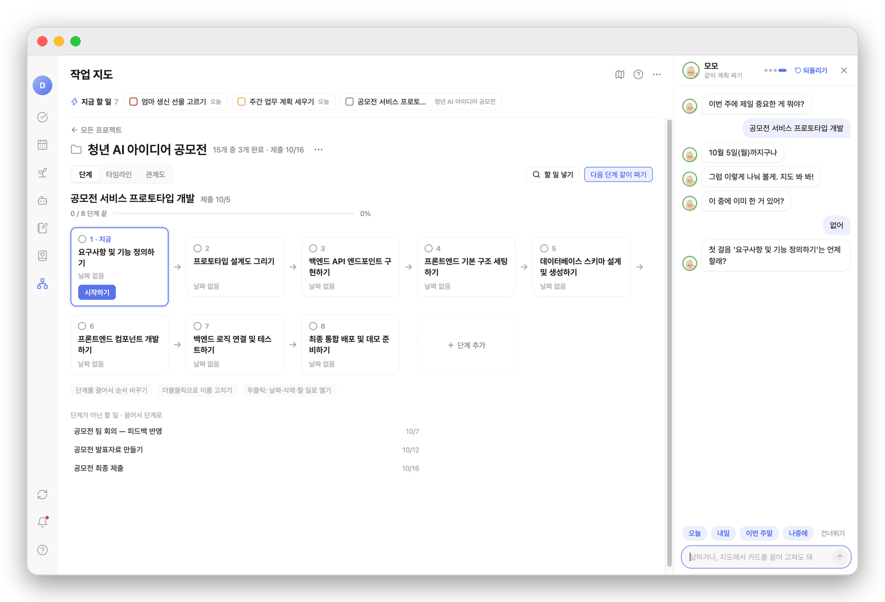
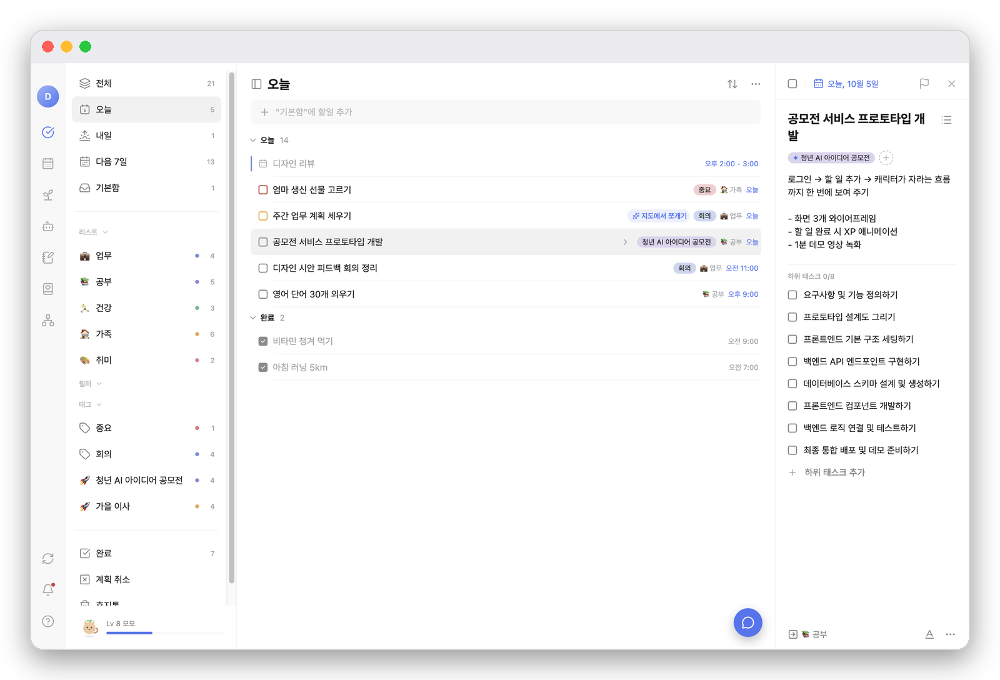
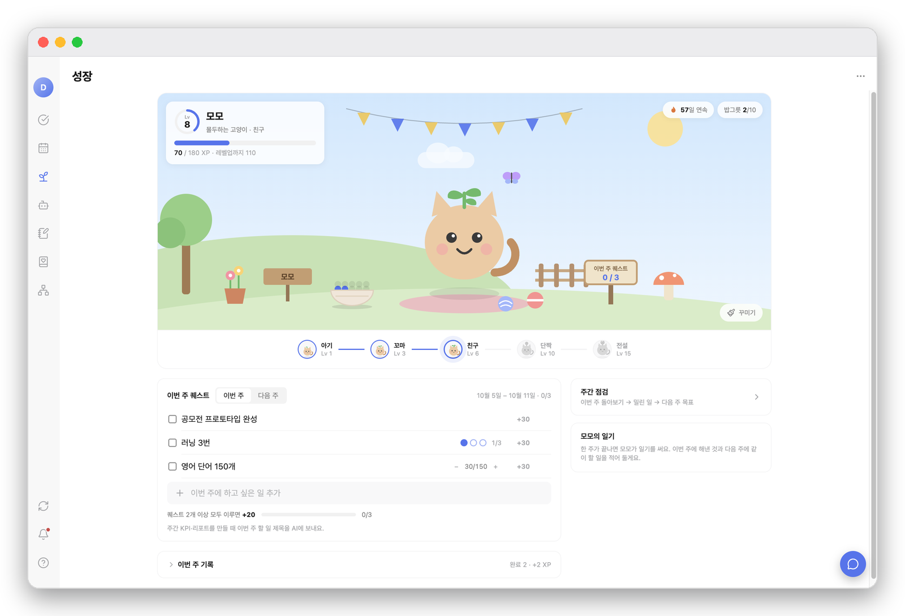
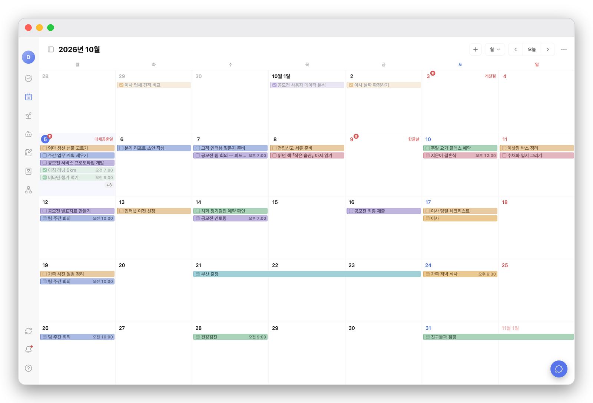

<p align="center">
  <picture>
    <source media="(prefers-color-scheme: dark)" srcset="docs/readme/banner-dark.png">
    
  </picture>
</p>

<p align="center">
  <a href="https://web-production-cd889.up.railway.app"><b>소개 사이트</b></a>
  &nbsp;·&nbsp;
  <a href="#기능">기능</a>
  &nbsp;·&nbsp;
  <a href="#화면">화면</a>
  &nbsp;·&nbsp;
  <a href="#시작하기">시작하기</a>
  &nbsp;·&nbsp;
  <a href="#문서">문서</a>
</p>

<p align="center">
  
  
  
  
  
  
</p>

---

평소처럼 할 일을 적기만 하면 됩니다. **분류와 정리는 AI가** 하고, 할 일을 끝낼 때마다 **XP가 쌓여 캐릭터가 진화**합니다.
AI는 우리 서버의 자체 모델에서만 돌고, 요청 원문은 남기지 않습니다.

> 제품 이름은 **꿈틀**(영문 Kkumteul)입니다. `sprout`는 코드네임이라 패키지 이름·번들 ID(`app.sprout.*`)·URL 스킴(`sprout://`)·데이터 폴더·저장소 이름에는 그대로 남아 있습니다.

## 기능

<table>
  <tr>
    <td width="50%" valign="top">
      <h3>✅ 할 일 · 캘린더</h3>
      오늘·내일·다음 7일, 리스트·폴더·태그·필터<br>
      월·주·일 캘린더에서 끌어서 일정 바꾸기<br>
      한국 공휴일, 자체 일정 + 구글·애플 캘린더
    </td>
    <td width="50%" valign="top">
      <h3>✨ AI 자동 정리</h3>
      새 할 일을 맞는 리스트로 옮기고<br>
      태그와 프로젝트를 저절로 붙입니다<br>
      확실할 때만 자동, 고친 건 다시 안 건드림
    </td>
  </tr>
  <tr>
    <td valign="top">
      <h3>🗺️ 작업 지도</h3>
      흩어진 일을 프로젝트별로 자동으로 묶어<br>
      단계 보드 · 관계 타임라인 · 관계도로 보고 편집<br>
      캐릭터와 대화하며 다음 단계 같이 짜기
    </td>
    <td valign="top">
      <h3>🌱 성장</h3>
      할 일 → XP → 캐릭터 진화<br>
      거북이 · 다람쥐 · 고양이 · 수달, 알부터 전설까지<br>
      주간 목표 · 주간 점검 · 리포트
    </td>
  </tr>
  <tr>
    <td valign="top">
      <h3>📥 수집함 · 일기</h3>
      링크와 메모를 모아 LLM 위키로 정리<br>
      캐릭터와 이야기하는 일기
    </td>
    <td valign="top">
      <h3>📱 어디서나</h3>
      맥 · iOS · Android 위젯, 푸시 알림<br>
      오프라인 우선 동기화, 테마 13가지
    </td>
  </tr>
</table>

## 화면

<p align="center">
  <picture>
    <source media="(prefers-color-scheme: dark)" srcset="docs/readme/readme-map-dark.png">
    
  </picture>
  <br><sub><b>작업 지도</b> — 흩어진 일을 프로젝트로 묶고, 캐릭터와 다음 단계를 같이 짜요</sub>
</p>

<table>
  <tr>
    <td width="33%" valign="top">
    <picture>
      <source media="(prefers-color-scheme: dark)" srcset="docs/readme/readme-today-dark.png">
      
    </picture>
    </td>
    <td width="33%" valign="top">
    <picture>
      <source media="(prefers-color-scheme: dark)" srcset="docs/readme/readme-growth-dark.png">
      
    </picture>
    </td>
    <td width="33%" valign="top">
    <picture>
      <source media="(prefers-color-scheme: dark)" srcset="docs/readme/readme-calendar-dark.png">
      
    </picture>
    </td>
  </tr>
  <tr>
    <td align="center"><sub><b>오늘</b> — AI가 태그와 프로젝트를 알아서 붙여요(✦)</sub></td>
    <td align="center"><sub><b>성장</b> — 할 일을 끝낼수록 캐릭터가 자라요</sub></td>
    <td align="center"><sub><b>캘린더</b> — 할 일·일정·공휴일을 한눈에</sub></td>
  </tr>
</table>

## 구조

| 폴더 | 내용 |
|---|---|
| `apps/desktop` | Electron + React + TypeScript (electron-vite). PowerSync는 메인 프로세스(`@powersync/node`) |
| `apps/mobile` | Expo SDK 57 · React Native · expo-router (PowerSync React Native + op-sqlite) |
| `packages/schema` | 동기화 테이블 정의와 공용 로직 — 할 일·성장·태그·프로젝트·공휴일·알림 |
| `packages/tokens` | 디자인 토큰, 테마 13가지 |
| `server` | Docker Compose: Postgres(`wal_level=logical`) + PowerSync + Node API(인증·업로드·AI 프록시·푸시) |
| `site` | 소개 사이트, 개인정보 처리방침·약관 (Railway) |
| `docs` | PRD, 화면 명세, 조사 자료, 출시 자료 |

## 시작하기

준비물: **Node 22** · npm 11 · Docker. 모바일은 Xcode·CocoaPods(iOS) 또는 Android SDK·JDK 21.

```bash
npm install
. scripts/node22.sh        # 이 셸만 Node 22로 (시스템 Node 26에서는 Electron 설치가 조용히 실패)

npm run dev                # 데스크톱
npm run mobile:ios         # iOS 시뮬레이터
npm run mobile:android     # Android 에뮬레이터
cd server && docker compose up -d --build   # 서버 (server/README.md)
```

<details>
<summary><b>주의할 점</b></summary>

- npm 11은 설치 스크립트를 기본으로 막습니다. `electron`, `better-sqlite3` 등은 `npm approve-scripts`로 허용하세요.
- 데스크톱은 기본으로 운영 서버에 붙습니다. 로컬 서버를 쓰려면 `SPROUT_API_URL` · `SPROUT_SYNC_URL`을 지정하세요.
- 구글 로그인 등 외부 키는 저장소에 없습니다. `apps/mobile/.env.local`, `server/.env` 예시는 각 README에 있습니다.
- Metro를 `CI=1`로 띄우면 파일 감시가 꺼집니다. 시뮬레이터 확인 때는 빼고 띄우세요.
</details>

<details>
<summary><b>검사</b></summary>

```bash
npm run typecheck && npm test && npm run test:desktop && npm run test:api && npm run build
npm run typecheck:mobile && npm run test:mobile
```
</details>

## 문서

- [PRD-sprout.md](PRD-sprout.md) — 제품 범위와 결정
- [docs/screens](docs/screens) — 화면 명세 (코드보다 먼저 씁니다)
- [HANDOFF.md](HANDOFF.md) — 지금 상태와 다음 할 일
- [docs/release/RELEASE-CHECKLIST.md](docs/release/RELEASE-CHECKLIST.md) — 출시 체크리스트

## 라이선스

아직 정하지 않았습니다. 정하기 전까지 모든 권리는 저작자에게 있습니다 (All rights reserved).
