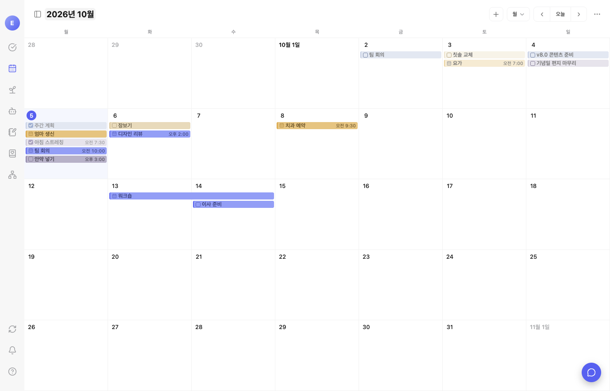
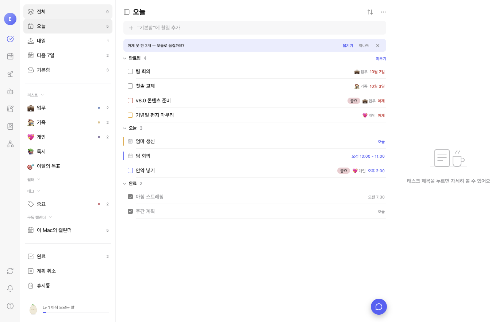
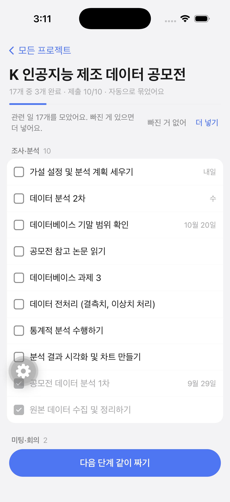

<p align="center">
  
</p>

<h1 align="center">sprout</h1>

<p align="center">
  할 일을 끝낼수록 캐릭터가 자라는 할 일·캘린더 앱<br/>
  데스크톱(macOS·Windows) · 모바일(iOS·Android)
</p>

> `sprout`는 코드네임입니다. 정식 제품명은 출시 전에 정합니다.

## 무엇인가

평소처럼 할 일을 적기만 하면 됩니다. 분류와 정리는 AI가 알아서 하고, 할 일을 끝낼 때마다 XP가 쌓여 캐릭터가 진화합니다.

- **할 일·캘린더**: 스마트 목록(오늘·내일·다음 7일), 리스트·폴더·태그·필터, 월·주·일 캘린더, 끌어서 일정 바꾸기, 한국 공휴일, 자체 일정과 구글·애플 캘린더 읽기
- **AI 자동 정리**: 새 할 일을 맞는 리스트로 옮기고 태그와 프로젝트를 저절로 붙입니다. 확실할 때만 자동으로 하고, 사용자가 고친 것은 다시 건드리지 않습니다.
- **작업 지도**: 여러 리스트에 흩어진 일을 프로젝트별로 묶어 보여 줍니다. 단계 보드, 관계 타임라인, 관계도를 직접 편집할 수 있고, 캐릭터와 대화하며 다음 단계를 함께 짤 수 있습니다.
- **성장**: 할 일 → XP → 캐릭터 진화(거북이·다람쥐·고양이·수달), 주간 목표, 주간 점검, 리포트
- **수집함·일기**: 링크와 메모를 모아 LLM 위키로 정리하는 수집함, 캐릭터와 이야기하는 일기
- **그 밖에**: 맥·모바일 위젯, 푸시 알림(FCM), 오프라인 우선 동기화, 13가지 테마

AI는 우리 서버에서 자체 모델(Ollama)로만 돌립니다. 요청 원문은 서버에 남기지 않습니다.

## 화면

| 캘린더 | 오늘 | 작업 지도(모바일) |
|---|---|---|
|  |  |  |

## 구조

```
apps/desktop    Electron + React + TypeScript (electron-vite). PowerSync는 메인 프로세스(@powersync/node)
apps/mobile     Expo SDK 57 · React Native · expo-router (PowerSync React Native + op-sqlite)
packages/schema 동기화 테이블 정의와 공용 로직(할 일·성장·태그·프로젝트·공휴일·알림 등)
packages/tokens 디자인 토큰(테마 13개)
server/         Docker Compose: Postgres(wal_level=logical) + PowerSync Open Edition + Node API
                (인증 JWT·업로드·AI 프록시·푸시). AI 작업자 server/ai-worker
site/           소개 웹사이트와 개인정보 처리방침·약관 페이지
docs/           PRD, 화면 명세(docs/screens), 조사 자료, 출시 문서(docs/release)
```

## 시작하기

준비물: **Node 22**(시스템 Node 26에서는 Electron 설치가 조용히 실패합니다), npm 11, Docker. 모바일은 Xcode·CocoaPods(iOS) 또는 Android SDK·JDK 21.

```bash
npm install
. scripts/node22.sh            # 이 셸만 Node 22로

npm run dev                    # 데스크톱 앱 (개발 실행)
npm run mobile:ios             # 모바일 iOS 시뮬레이터
npm run mobile:android         # 모바일 Android 에뮬레이터

cd server && docker compose up -d --build   # 서버 일체 (server/README.md 참고)
```

- npm 11은 설치 스크립트를 기본으로 막습니다. `electron`, `better-sqlite3` 등은 `npm approve-scripts`로 허용하세요.
- 앱은 기본으로 운영 서버에 붙습니다. 로컬 서버를 쓰려면 `SPROUT_API_URL`·`SPROUT_SYNC_URL`을 지정하세요(데스크톱).
- 구글 로그인 등 외부 키는 저장소에 없습니다. `apps/mobile/.env.local`, `server/.env` 예시는 각 README에 있습니다.

## 검사

```bash
npm run typecheck && npm test && npm run test:desktop && npm run test:api && npm run build
npm run typecheck:mobile && npm run test:mobile
```

## 문서

- 제품 범위와 결정: [PRD-sprout.md](PRD-sprout.md)
- 화면 명세: [docs/screens](docs/screens) — 코드보다 먼저 씁니다
- 지금 상태와 다음 할 일: [HANDOFF.md](HANDOFF.md)
- 출시 인계(앱스토어·플레이·서버): [docs/release/HANDOVER.md](docs/release/HANDOVER.md)
- 출시 체크리스트: [docs/release/RELEASE-CHECKLIST.md](docs/release/RELEASE-CHECKLIST.md)

## 라이선스

아직 정하지 않았습니다. 정하기 전까지 모든 권리는 저작자에게 있습니다(All rights reserved).
