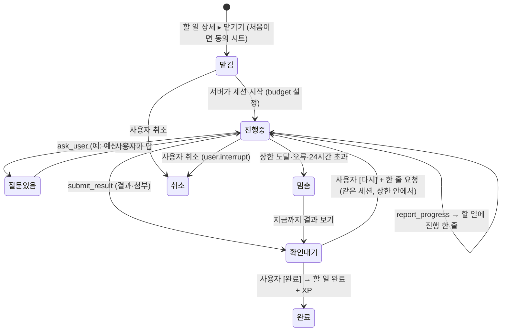

# 조사: 할 일을 클라우드 AI 에이전트에 "맡기기" (2026-10-10)

- 요청(사용자, 2026-10-10): 꿈틀에서 만든 할 일을 클라우드 AI 에이전트에 맡긴다. 에이전트가 일을 하고 진행 상황·결과를 그 할 일에 남기면, 사용자가 확인해 완료한다. 예로 "muse"와 "그록봇"을 들었다. "사용자가 직접 OAuth 방식으로 하는 건 너무 귀찮으니까" → **사용자가 연결 설정을 하지 않는 방법**을 찾는다.
- 틱틱 조사가 아니라 꿈틀 자체 조사라서 이 폴더 번호만 이어 쓴다(39 다음).
- 범위: 조사와 추천만. 코드·명세는 건드리지 않았다. 만들기로 정하면 `docs/screens/5x-delegate.md` 명세부터 쓴다(CLAUDE.md 규칙).
- 표기: **[확인]** 이번 조사에서 1차 문서·기사를 직접 열어 본 것 · **[불확실]** 2차 기사에만 있거나 문서에 없는 것 · **[미확인]** 이번 세션에서 열어 보지 못하고 기존 지식에 기댄 것(검색 한도를 다 써서 웹 검색을 더 못 했다. 만들기 전에 다시 확인할 것).

## 0. 결론 먼저
1. **"Muse" = Meta의 개인 AI 에이전트 Muse**(2026-09-08 발표). 사용자마다 클라우드 VM에서 오래 걸리는 일을 대신 한다. **미국 전용이고, 다른 앱이 일을 맡길 공개 API가 없다**(밑바탕 모델 Muse Spark API만 있음). 꿈틀이 지금 붙일 수 없다.
2. **"그록봇" = xAI의 Grok Bots**(2026-08-11 베타, "AI 팀원" 클라우드 에이전트) 그리고 그 팀판인 Team Bots(2026-09-28, Slack). **다른 앱이 일을 맡길 공개 API·웹훅은 확인되지 않았다.** 개발자가 쓸 수 있는 건 xAI API(Grok 4.7, Responses API, 원격 MCP 도구, deferred = 폴링만)다.
3. 사용자 손이 안 드는 방법은 **(a) 꿈틀 서버가 우리 API 키로 에이전트를 직접 돌리기** 하나뿐이다. 사용자는 `맡기기`만 누르고, 연결·로그인·토큰이 없다.
4. 첫 공급자 추천: **Anthropic Claude Managed Agents**. 오래 걸리는 세션, 클라우드 샌드박스(웹 검색·웹 읽기·코드·파일), 웹훅, **세션별 달러 상한(budget)**, 우리 서버로 돌아오는 사용자 정의 도구, 도구 확인(permission policy)이 다 있다. 두 번째는 OpenAI Responses API(background + 웹훅).
5. 비용 감: 조사·정리형 맡기기 1건에 **약 $0.10~0.40**(중급 모델 기준, 아래 §4.5). 무료 앱이라 **사용자당 주 2건 + 건당 상한 $0.40 + 전체 월 상한**으로 막는다.
6. Mac mini qwen3.5:9b는 맡기기에 쓸 수 없다. 웹을 찾아다니며 여러 번 도구를 부르는 일에는 너무 약하다(research 39: 쓰기 도구 0/15, 날짜 오답이 가장 흔함). 대체 경로로 두지 않는다.
7. **AI 원칙을 바꿔야 한다.** PRD "모든 AI는 오너의 Mac mini에서 돈다 · 제3자 AI 공급자에게는 가지 않는다"와 처리방침 문구에 "맡기기만 예외, 처음 쓸 때 동의"를 넣어야 한다 → §5 결정 필요.

## 1. "Muse"와 "그록봇"은 무엇인가

### 1.1 Meta Muse — 가장 유력 [확인]
| 항목 | 내용 | 근거 |
|---|---|---|
| 무엇 | "오래 걸리는 일을 대신 하는 개인 AI 에이전트". 메일·여행·서류·청구서·구매(Stripe Link)를 뒤에서 처리 | Meta 발표 2026-09-08, Wikipedia |
| 어디서 도나 | 사용자마다 따로 **Muse Secure VM**(클라우드 VM)에 에이전트와 데이터가 같이 있다. 브라우저 화면을 실시간으로 보여 줌 | Meta 발표 |
| 안전 | **Sentinel** 에이전트가 밖으로 나가는 행동(돈 쓰기·메시지 보내기) 전에 사람에게 허락을 받음 | Meta 발표, tech-insider |
| 플랫폼 | iOS·Android·muse.ai·WhatsApp, 2026-09-17 Mac 앱, 2026-09-23 macOS 앱 조작·**에이전트 전용 이메일 주소**·실시간 아바타 | Wikipedia, tech-insider |
| 지역 | **미국 전용**(다른 나라 일정 없음). 18세 이상, 무료여도 결제 카드 필요 | codersera, tech-insider |
| 가격 | 무료(주 1억 토큰) · Power $20/월(주 5억) · Maximum $100/월(주 30억) | tech-insider [불확실: 토큰 수치는 2차 기사] |
| 소상공인판 | 2026-09-29 Shopify·Slack·Notion·Asana·Stripe 등 연동 추가. "Muse API", "Muse Code"를 언급했으나 세부 없음 | TechCrunch 2026-09-29 |
| 개발자 API | **소비자 에이전트에 일을 맡기는 공개 API 없음.** 모델 Muse Spark 1.3만 Meta Model API로 제공($1.25/$4.25 per 1M) | codersera [불확실], Meta 발표에 API 언급 없음 |
| MCP | 공식 지원 발표 없음 | codersera |
| 웹훅 | 없음(문서 없음) | — |
| 개인정보 | 대화·VM 데이터를 광고에 쓰지 않는다고 약속. **모델 학습에는 기본으로 쓰고 끌 수 있음**(Wikipedia). 출시 직후 Amazon이 차단(2026-09-21, 자격 증명 수집 우려) | Meta 발표, Wikipedia |

→ 꿈틀 사용자는 대부분 한국에 있어 Muse를 쓸 수 없고, 꿈틀이 일을 넣을 통로(API·MCP·웹훅)도 없다. 에이전트 이메일 주소로 일을 보내는 길(§3 (b))은 이론상 있지만 미국 사용자만 되고 결과를 돌려받을 통로가 없다.

다른 "Muse" 후보도 있었지만 "클라우드형 에이전트"에 맞는 것은 Meta Muse뿐이다. Microsoft Muse(2025-02, 게임 장면 생성 모델)는 에이전트가 아니다 [미확인].

### 1.2 xAI Grok Bots — "그록봇" [대체로 확인, 세부는 불확실]
| 항목 | 내용 | 근거 |
|---|---|---|
| 무엇 | **Grok Bots**: 2026-08-11 베타. "AI 팀원" 클라우드 에이전트. 앱·도구·웹사이트에 로그인해 일하고, 여러 봇이 서로 메시지를 주고받음 | Wikipedia "Grok Build" |
| 팀판 | **Team Bots**(2026-09-28 공개 베타, Teams·Enterprise 요금제): 팀이 같은 맥락·도구·기억을 공유. Slack에 봇마다 핸들이 있음. Notion·Linear 등 연동 | xAI 릴리스 노트(releasebot) |
| 백그라운드 | Grok Build(코딩 CLI)·Grok 앱에서 "백그라운드로 일하기"(2026-07) | basenor, releasebot |
| 다른 앱이 맡기는 API | **확인 못 함.** Grok Bots·Team Bots를 외부에서 부르는 API·웹훅 문서가 없다(grok.com/bots는 내용이 안 열림, docs.x.ai에 Bots 문서 없음) | [불확실] |
| 개발자 API | xAI API **Grok 4.7**(2026-09-21): 입력 $2 · 캐시 $0.50 · 출력 $6 per 1M, 50만 컨텍스트, 함수 호출·웹 검색·X 검색·코드 실행. 미국 지역 엔드포인트(+10%) | docs.x.ai Grok 4.7 |
| MCP | xAI API가 **원격 MCP 서버를 도구로 부른다**(`server_url` + `authorization` 헤더, Streamable HTTP·SSE) — 꿈틀이 MCP 서버를 열면 Grok이 거기에 진행·결과를 쓸 수 있다 | docs.x.ai Remote MCP Tools |
| 비동기 | **deferred completions**: `deferred:true` → `request_id`로 **폴링만**, 결과 24시간·한 번만 꺼낼 수 있음. **웹훅 없음** | docs.x.ai Deferred |
| 개인정보 | Grok Build가 저장소 전체를 GCS에 올린 사건(2026-07) | Wikipedia "Grok Build" |

→ 사용자 말 "그록봇"은 Grok Bots일 가능성이 가장 높다. 텔레그램·X의 비공식 "Grok 봇"일 수도 있으나 "클라우드형 에이전트"라는 설명에는 Grok Bots가 맞다. 꿈틀이 지금 쓸 수 있는 것은 **xAI API**뿐이고, 이건 "에이전트 제품"이 아니라 모델 API라서 오래 걸리는 일의 루프·샌드박스·웹훅을 꿈틀이 직접 만들어야 한다.

## 2. 서버에서 부를 수 있는 클라우드 에이전트 비교

연결 수고가 적은 순서. "사용자 OAuth 없음" = 꿈틀 서버가 꿈틀의 API 키로 부른다.

| 순위 | 플랫폼 | 오래 걸리는 일 | 결과 알림 | 도구(웹·코드·파일) | 우리 도구 연결 | 1건 비용 감 | 상태 |
|---|---|---|---|---|---|---|---|
| 1 | **Anthropic Claude Managed Agents** | 세션(분~시간), 끊겨도 이어짐, 중간에 조종·중단 | **웹훅**(`session.status_idled`·`budget_reached`·`terminated`, 서명 검증) + SSE | Bash·파일·웹 검색·웹 읽기 내장, 도메인 허용 목록 | 원격 MCP · **사용자 정의 도구**(우리 서버가 답함) · 도구별 확인 정책 | 토큰 + 웹 검색 $10/1천 + **실행 $0.08/시간**. **세션별 달러 상한** | 베타(`managed-agents-2026-04-01`), 모든 API 계정 기본 허용 [확인] |
| 2 | **OpenAI Responses API**(background) | `background:true`, 폴링·취소·스트림 이어받기 | **웹훅** `response.completed` 등(Standard Webhooks 서명, 72시간 재시도) | 웹 검색 $10/1천, 코드 인터프리터 컨테이너 $0.03/20분(1GB)~ | 원격 MCP 도구, 함수 호출 | GPT-6.1-Sol $2/$10 per 1M | 정식 [확인]. 단 루프 길이·상한은 우리가 관리 |
| 3 | **Google Gemini Interactions API** | `background=true`, Deep Research 에이전트 | 문서 메뉴에 웹훅 있음(세부 미확인) | Google 검색·지도·코드·URL·컴퓨터 사용·파일 검색 | 함수 호출 | 가격 페이지 따로 [미확인] | 유료는 상호작용 55일 보관 [확인] |
| 4 | **Manus API** | 작업(task) 만들기·여러 턴 | **웹훅** `task_created`·`task_stopped`(finish/ask, 첨부 포함) | 자체 클라우드 컴퓨터, 파일 업로드 | 커넥터 | 크레딧제 [미확인] | 정식 [확인]. 2025-12 Meta 인수 → 중국 당국 차단 → 2026-08-11 독립 회사로 [확인] |
| 5 | xAI API (Grok 4.7) | deferred(폴링, 24시간) | 없음 | 웹·X 검색·코드 실행 | 원격 MCP | $2/$6 per 1M | 루프·샌드박스를 우리가 만들어야 함 [확인] |
| 6 | Google Jules API | 세션, 폴링 | 없음 | **GitHub 저장소 코딩 전용** | — | — | 알파 [확인] → 할 일 앱에 안 맞음 |
| 7 | Devin · OpenAI Codex cloud | 코딩 세션 | Devin은 API 있음 | 코딩 전용 | — | 비쌈 | [미확인] → 안 맞음 |
| 8 | Lindy · Zapier Agents · n8n · Genspark | 자동화·업무 에이전트 | Lindy·Zapier·n8n은 웹훅 트리거·이메일 트리거 | 앱 연동 중심 | 각자 커넥터 | 구독제 | [미확인]. 사용자가 **그 서비스에 가입·연결해야** 하므로 "귀찮지 않게"에 어긋남. n8n은 셀프호스트라 Mac mini에서 돌릴 수 있지만 머리(LLM)는 여전히 클라우드가 필요 |
| — | ChatGPT agent · Claude 앱 · Muse · Grok Bots | 소비자 제품 | 다른 앱이 일을 넣는 공개 API 없음 | — | 사용자가 커넥터를 붙이면 꿈틀 MCP를 부를 수 있음(§3 (c)(d)) | 사용자 구독 | [확인: Muse·Claude 앱 / 미확인: ChatGPT agent] |

정리: **"오래 걸림 + 웹훅 + 웹·코드·파일 + 우리 도구 + 비용 상한"을 한 번에 주는 것은 Claude Managed Agents가 유일하다.** OpenAI는 같은 일을 할 수 있지만 루프와 상한을 우리 서버가 들고 있어야 한다. Manus는 결과물(보고서·파일) 품질이 강점이지만 크레딧 가격이 불투명하고 회사 상황이 흔들렸다.

## 3. 사용자 OAuth 없이 연결하는 방법

| | (a) 꿈틀이 직접 돌림 | (b) 사용자별 매직 이메일·봇 핸들 | (c) 한 번 눌러 커넥터 설치 | (d) 꿈틀 MCP + 개인 토큰 한 번 복사 |
|---|---|---|---|---|
| 흐름 | 할 일에서 `맡기기` → 꿈틀 서버가 우리 키로 세션 시작 → 웹훅으로 결과 | 꿈틀이 에이전트의 메일 주소(예: Muse 에이전트 메일)로 할 일을 보냄 → 에이전트가 답장 → 꿈틀이 받은 편지를 할 일에 붙임 | ChatGPT 앱 디렉터리·Claude 커넥터에 "꿈틀"을 올려 두고, 사용자가 그 AI 앱에서 꿈틀을 켬 → 사용자의 AI가 꿈틀 MCP에서 "맡긴 일"을 꺼내 처리·보고 | 꿈틀 설정에서 `내 AI에 연결` → 주소·토큰을 복사 → 사용자가 Claude/ChatGPT/Grok 설정에 붙여 넣음 |
| 사용자 수고 | **없음** | 받는 쪽 주소를 한 번 넣음. 에이전트가 답장하게 지시를 따로 걸어야 함 | 디렉터리 등록이 끝나면 앱에서 한 번 켜기. 대부분 OAuth 화면 1장 | 복사·붙여넣기 1번(OAuth 없음) |
| 되는 곳 | 모든 사용자 | Muse는 미국만. 답장이 오는지 보장 없음 | Claude 커스텀 커넥터: 무료 1개·유료, URL 입력 + "로그인 없음/헤더 토큰" 가능, 모바일 앱도 됨 [확인]. **한 번 눌러 설치하는 딥링크는 Claude 문서에 없음** [확인]. ChatGPT는 디렉터리 심사 + "설치 딥링크" 항목이 문서 목차에 있음 [불확실] | 원격 MCP를 받는 곳 전부(Claude 앱·Claude API·OpenAI API·xAI API). Muse·Grok Bots는 미확인 |
| 결과가 할 일로 돌아오나 | 웹훅 → 확실 | 메일 파싱 → 불안정 | 사용자의 AI가 `report_progress` 도구를 불러야 함 → **사용자가 그 AI에 "꿈틀 맡긴 일 해 줘"라고 말해야 시작**(스스로 깨어나지 않음) | (c)와 같음 |
| 비용 | **꿈틀이 냄**(상한 필요) | 사용자 구독 | 사용자 구독 | 사용자 구독 |
| 보안 | 키는 서버에만. 사용자 데이터가 우리 → 공급자로 나감 | 메일 위조·스팸, 메일 본문이 사방에 남음 | OAuth면 표준. 디렉터리 심사 부담 | 토큰 유출 시 그 사람 할 일 읽기·쓰기 → 범위 좁힘(맡긴 일만) + 끊기 버튼 |
| 처리방침 영향 | **큼**: "제3자 AI에 안 감" 문구 수정, 처리 위탁(국외 이전) 고지, 처음 쓸 때 동의 | 큼(메일로 내보냄) | 중간: 사용자가 직접 연결 = 사용자 지시에 따른 제공 | 중간: (c)와 같음 |
| 스토어 심사 | Apple 5.1.2(i): 개인 데이터를 제3자 AI에 보내기 전 **알리고 명시 동의**(2025-11 개정) [미확인 — 출시 전 원문 확인]. Play: 운영자를 대신한 처리 위탁은 "공유"가 아니나 데이터 보안 양식·처리방침 갱신 | 같음 | 낮음 | 낮음 |
| 판정 | **추천(v1.x)** | 버림 | 나중(v2, 사용자 많을 때 디렉터리 등록) | **두 번째(v1.x+1, 고급 사용자용 "내 AI로 보내기")** |

- (c)의 핵심 한계: 사용자의 AI 앱은 **스스로 깨어나 일하지 않는다.** 사용자가 그 앱에서 "꿈틀에 맡긴 거 해 줘"라고 말해야 한다. 그래서 "맡기면 알아서 끝나 있다"는 경험은 (a)만 준다.
- Managed Agents에도 **예약 실행(scheduled deployments)** 이 있어 (a) 안에서 "매일 아침 맡긴 일 몰아서 처리" 같은 것도 우리 서버 cron 없이 된다 [확인].

## 4. 꿈틀 v1.x 추천 구조 — (a) Managed Agents 먼저

### 4.1 흐름과 상태

- 할 일 행: 제목 옆 작은 상태 알약(`맡김`·`진행 중`·`확인해 줘`) — 틱틱 행 꼬리표 말씨. 상세: "맡긴 일" 영역에 진행 줄 목록(시각 + 한 줄) → 결과 카드(요약 + 링크 + 첨부) → `완료` · `다시 해 줘` 버튼.
- **완료는 사람만 누른다.** 에이전트는 `submit_result`까지만. 완료 시 XP는 평소 할 일 완료와 같다(맡긴 일이라고 깎지 않음 — 결정은 명세에서).
- 알림: `확인해 줘`가 되면 푸시(기존 FCM 경로, 페이로드에 결과 글은 안 넣음 — PRD 푸시 원칙과 같음).

### 4.2 서버 구조
- `server/api`에 `delegate` 모듈: `POST /delegations`(할 일 id, 지시 한 줄) → 상한 검사 → 공급자 어댑터 `startSession()` → 웹훅 `POST /webhooks/agent` 받으면 세션을 다시 읽어 상태 반영. 어댑터 인터페이스(`start/send/interrupt/fetch/delete`)로 두어 OpenAI·Manus를 뒤에 끼울 수 있게.
- 에이전트 정의(한 번 만듦): 시스템 지시(한국어 답, 출처 링크 필수, 밖으로 보내기·결제·가입·로그인 금지, 모르면 ask_user), 내장 도구 = 웹 검색·웹 읽기·코드·파일, **사용자 정의 도구 3개** = `report_progress(text)` · `ask_user(question)` · `submit_result(summary_md, links[], files[])`. 이 도구들은 우리 서버가 받아 DB에 쓴다.
- 에이전트에 **꿈틀 데이터 전체를 주지 않는다.** 맡긴 할 일의 제목·메모·하위 할 일·사용자가 쓴 지시 한 줄만 첫 메시지로 보낸다.

### 4.3 저장하는 것
| 표(새, PowerSync 동기화) | 필드 | 보관 |
|---|---|---|
| `task_delegations` | id, task_id, user_id, provider, provider_session_id, status(queued/running/needs_input/review/done/canceled/stopped), instruction, cost_cents, started_at, finished_at | 할 일과 함께 |
| `delegation_events` | id, delegation_id, kind(progress/question/answer/result/error), text, created_at | 할 일과 함께. 진행 줄은 최대 50개 |
| 결과 | `result_md`(요약 + 출처 링크), 첨부는 기존 업로드 저장소로 내려받아 저장(파일당 10MB·건당 5개 상한) | 할 일과 함께 |
| 공급자 쪽 기록 | 세션·이벤트·샌드박스 | **완료·취소 7일 뒤 우리가 세션·파일 삭제 API로 지움**(Managed Agents는 ZDR 대상 아님 [확인]) |
| 원시 로그(도구 호출 전부) | 저장 안 함. 비용·토큰 수치만 `ai_usage`에 용도 `delegate`로 | — |

### 4.4 안전 — 밖으로 나가는 행동 금지
- 메일 보내기·메시지·결제·가입·로그인·폼 제출 도구를 **아예 주지 않는다**(MCP·자격 증명 금고 없음). 웹은 읽기만(검색·가져오기), 코드는 샌드박스 안에서만.
- 도구 확인 정책: 내장 도구 외 새 도구가 생기면 기본 "확인 필요"(`user.tool_confirmation`), v1.x에선 그런 도구 자체가 없음.
- 결과의 링크·숫자는 출처를 붙이게 하고, 결과 카드에 "AI가 찾은 내용이에요 · 확인하고 써 주세요"를 둔다.
- 할 일 제목에 남의 개인정보가 있을 수 있음 → 동의 시트에 "이 할 일의 제목·메모가 AI 공급자에게 전달돼요"를 그대로 보여 줌.
- 남용: 계정 나이 7일 미만은 막기, 같은 지시 반복 차단, 공급자 정책 위반 응답이면 멈춤.

### 4.5 상한과 비용 감
1건 가정(조사·비교·정리형): 웹 검색 8회, 들어간 토큰 15만(이 중 10만은 캐시 적중), 나온 토큰 1만, 실행 10분.

| 모델(Managed Agents) | 토큰 | 검색 8회 | 실행 10분 | 1건 합계 |
|---|---|---|---|---|
| Claude Haiku 5.5 ($0.10/$0.50) | ≈ $0.01 | $0.08 | $0.013 | **≈ $0.10** |
| Claude Sonnet 5.5 ($2/$10, 캐시 $0.10) | ≈ $0.21 | $0.08 | $0.013 | **≈ $0.30** |
| Claude Opus 5.5 ($4/$20) | ≈ $0.42 | $0.08 | $0.013 | ≈ $0.51 |
| (참고) OpenAI GPT-6.1-Sol ($2/$10) + 웹 검색 $10/1천 | ≈ $0.22 | $0.08 | 컨테이너 $0.03 | ≈ $0.33 |

- 가격 근거: Anthropic 가격표(Sonnet 5.5 $2/$10, Haiku 5.5 $0.10/$0.50, 웹 검색 $10/1천, Managed Agents 실행 $0.08/세션-시간), OpenAI 가격표 — 모두 2026-10-10 열람 [확인]. 토큰 양은 가정이다 [임시 — 첫 20건 실측 뒤 고침].
- 추천 상한 [임시]: 기본 모델 Sonnet 5.5, **세션 budget 40¢**(넘으면 멈춤 → 지금까지 결과로 확인 대기), **사용자당 주 2건**(`다시`는 같은 건 안에서 1번), **서비스 전체 월 $50**(넘으면 그 달은 "이번 달 맡기기 자리가 다 찼어요"). 최악의 경우 사용자 1명 월 ≈ $3.5 → 활성 맡기기 사용자 약 15명까지 월 $50 안. 사용자가 늘면 유료(꿈틀 플러스) 또는 상한 조정.
- 서버가 강제: `ai_usage` 용도 `delegate`로 주 횟수, `cost_cents` 합으로 월 총액. Managed Agents budget은 하드 상한이라 한 건이 폭주해도 40¢ 근처에서 멈춘다 [확인 — 요청 1번만큼 넘칠 수 있음].

### 4.6 공급자와 대체 경로
- **시작: Anthropic Managed Agents(Sonnet 5.5)** 하나. 이유: 웹훅·세션 상한·사용자 정의 도구·샌드박스가 한 덩어리, 베타지만 모든 API 계정에 기본 허용.
- **두 번째: OpenAI Responses API background + 웹훅**(어댑터만 추가). Anthropic 장애·정책 문제 때 갈아탈 길.
- **Muse·Grok Bots:** 지금은 못 붙인다(공개 API 없음 / 미국 전용). 공개 API나 원격 MCP 지원이 나오면 (d) "내 AI로 보내기"로 붙이는 게 맞다.
- **Mac mini qwen3.5:9b로 대체하지 않는다.** 맡기기는 웹을 여러 번 검색하고 읽고 고르는 일인데, 9B 모델은 research 39에서 쓰기 도구를 한 번도 고르지 못했고 날짜 계산부터 자주 틀렸다. 인터넷 도구도 없다. 공급자가 안 되면 "지금은 맡길 수 없어요"로 정직하게 멈춘다. (Mac mini가 할 수 있는 건 맡기기 전 "지시 한 줄 다듬기" 정도 — 선택 사항.)

### 4.7 개인정보 문구와 처음 동의
- 처리방침에 추가: "**맡기기(선택 기능)**: 사용자가 할 일을 맡기면 그 할 일의 제목·메모·하위 할 일과 사용자가 쓴 지시를 AI 처리를 위해 Anthropic(미국)에 보냅니다. 공급자는 이 데이터를 모델 학습에 쓰지 않으며[출시 전 Anthropic 상용 약관 원문 확인], 꿈틀은 작업이 끝나고 7일 안에 공급자 쪽 기록을 지웁니다. 결과는 꿈틀 서버에 할 일과 함께 저장됩니다." + 국외 이전 항목(이전받는 자·국가·항목·목적·보유 기간) — 개인정보보호법 제28조의8.
- PRD "AI 사용 원칙"과 47 명세의 "밖으로 나가는 것 없음"은 **AI 비서·분류·위키·성장에는 그대로**, 맡기기만 예외로 적는다.
- 처음 `맡기기`를 누를 때 동의 시트(한 번): 무엇이 어디로 가는지 3줄 + `동의하고 맡기기` / `안 할래요`. 설정 ▸ AI에서 끌 수 있고, 끄면 진행 중인 건 취소.
- 스토어: Apple 라벨은 "기타 사용자 콘텐츠"가 이미 있음 → 목적 변화 없음, 심사 메모에 "선택 기능, 사용 전 명시 동의, 제3자 AI 공급자 이름 표시". Play 데이터 보안: 처리 위탁이라 "공유 아니요" 유지 가능하나 처리방침 갱신 필수.
- 공급자 이름 표시: Anthropic 브랜딩 규칙상 "Claude Agent"·"꿈틀 도우미 Powered by Claude"는 되고 "Claude Code"는 안 된다 [확인]. 꿈틀 안에서는 캐릭터가 맡아 주는 모양으로 두고 작은 글씨로 공급자를 밝힌다.

### 4.8 대략 일정(1명 기준)
| 일 | 기간 |
|---|---|
| 화면 명세 `docs/screens/5x-delegate.md` + 확인 | 1일 |
| 스키마(`task_delegations`·`delegation_events`) + 마이그레이션 + PowerSync 규칙 | 1일 |
| 서버: 어댑터(Managed Agents) · 웹훅 · 사용자 정의 도구 처리 · 상한 · 정리 작업 | 3~4일 |
| 데스크톱·휴대폰: 맡기기 버튼·동의 시트·상태 알약·진행 줄·결과 카드·완료/다시 | 3~4일 |
| 처리방침·데이터 인벤토리·스토어 답변 갱신 | 0.5일 |
| 실측 20건(비용·품질) + 상한 조정 | 1일 |
| **합계** | **약 2주** |
| (나중) (d) 꿈틀 MCP 서버 + 개인 토큰 "내 AI로 보내기" | +3~4일 |

## 5. 결정 필요
1. **AI 원칙 예외를 둘까?** 지금 원칙은 "모든 AI는 Mac mini, 제3자 AI에 안 감"이다. → **추천: 맡기기만 예외**(선택 기능, 처음 쓸 때 동의, 끄기 가능). 다른 AI 기능은 그대로 Mac mini.
2. **비용을 누가 내나 / 상한은?** → **추천: 꿈틀이 낸다. 사용자당 주 2건 · 건당 40¢ · 서비스 전체 월 $50.** 실측 20건 뒤 숫자를 고친다. 유료 요금제는 사용자가 늘 때 다시 본다.
3. **첫 공급자?** → **추천: Anthropic Claude Managed Agents(Sonnet 5.5)**, 어댑터 구조로 OpenAI Responses API를 두 번째로. Muse·Grok Bots는 공개 API가 생기면 다시 본다.
4. **"내 AI로 보내기"(꿈틀 MCP + 개인 토큰)를 v1.x에 같이 넣을까?** → **추천: 뒤로 미룸**(v1.x+1). 사용자가 자기 AI 앱에서 직접 말을 걸어야 시작돼 "맡기면 알아서" 경험이 안 나온다. 고급 사용자 요청이 오면 붙인다.

## 6. 출처 (열람 2026-10-10)
- Meta, "Introducing Muse: The World's First Personal AI Agent Built for Everyone" (2026-09): https://about.fb.com/news/2026/09/introducing-muse-personal-ai-agent/
- Wikipedia, "Muse (AI agent)": https://en.wikipedia.org/wiki/Muse_(AI_agent)
- TechCrunch, "Meta is expanding its AI agent Muse to small businesses" (2026-09-29): https://techcrunch.com/2026/09/29/meta-is-expanding-its-ai-agent-muse-to-small-businesses/
- Codersera, "Meta Muse Guide 2026": https://codersera.com/blog/meta-muse-ai-agent-app-guide-2026/
- Tech Insider, "Meta Launches Muse AI Agent: $20 and $100 Tiers [2026]": https://tech-insider.org/meta-muse-personal-ai-agent-launch-2026/
- Wikipedia, "Grok Build"(Grok Bots 2026-08-11 베타 포함): https://en.wikipedia.org/wiki/Grok_Build
- xAI 릴리스 노트(Releasebot, Team Bots 2026-09-28 · Grok 4.7 2026-09-21): https://releasebot.io/updates/xai
- Basenor, "Grok Agents in Background Mode" (2026-07): https://www.basenor.com/blogs/news/grok-agents-in-background-mode-what-it-means-for-you
- xAI Docs, Grok 4.7: https://docs.x.ai/developers/grok-4-7 · Remote MCP Tools: https://docs.x.ai/docs/guides/tools/remote-mcp-tools · Deferred Chat Completions: https://docs.x.ai/docs/guides/deferred-chat-completions
- Anthropic, Claude Managed Agents overview: https://platform.claude.com/docs/en/managed-agents/overview · Webhooks: https://platform.claude.com/docs/en/managed-agents/webhooks · Session budgets: https://platform.claude.com/docs/en/managed-agents/budgets · Reference(브랜딩·요율 제한): https://platform.claude.com/docs/en/managed-agents/reference · Pricing: https://platform.claude.com/docs/en/about-claude/pricing
- Claude Help Center, 원격 MCP 커스텀 커넥터: https://support.claude.com/en/articles/11175166-getting-started-with-custom-connectors-using-remote-mcp
- OpenAI, Background mode: https://developers.openai.com/api/docs/guides/background · Webhooks: https://developers.openai.com/api/docs/guides/webhooks · Pricing: https://developers.openai.com/api/docs/pricing · Apps SDK: https://developers.openai.com/apps-sdk
- Google, Gemini Interactions API(2026-10-01 갱신): https://ai.google.dev/gemini-api/docs/interactions · Jules API(알파): https://developers.google.com/jules/api
- Manus API: https://open.manus.ai/docs · Webhooks: https://open.manus.ai/docs/webhooks · Wikipedia "Manus (AI agent)": https://en.wikipedia.org/wiki/Manus_(AI_agent)
- 내부: [PRD AI 사용 원칙](../../PRD-sprout.md) · [47 AI 비서 B안](../screens/47-assistant-free-chat.md) · [research 39](39-assistant-tools-eval.md) · [스토어 개인정보 답변](../release/store/privacy-answers.md)
